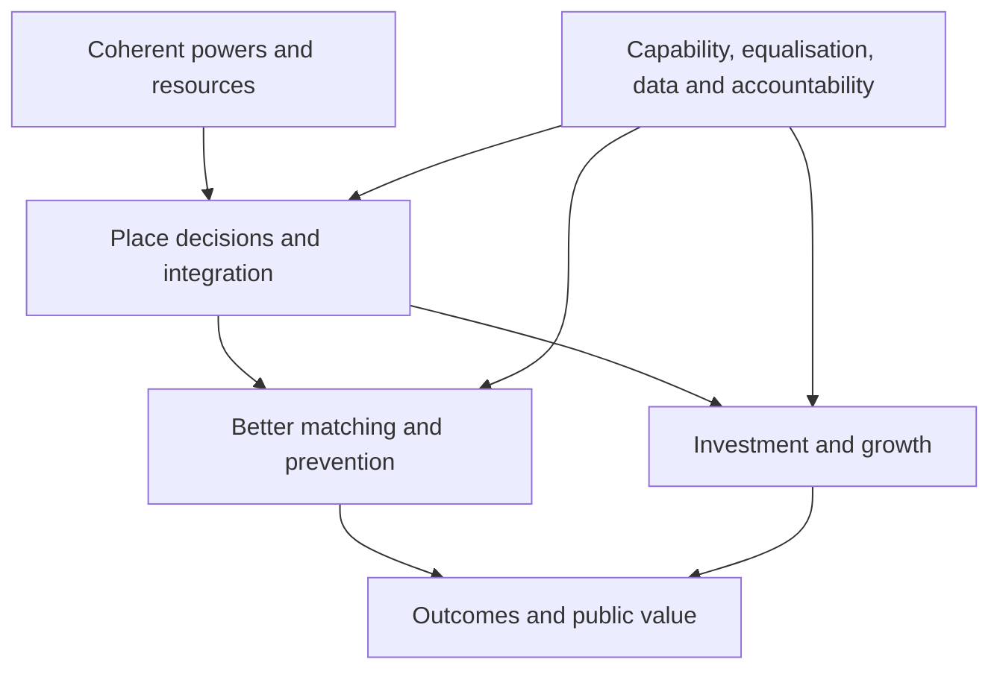

# Rewiring the State: full rapid evidence assessment

**Assessment date:** 9 August 2026  
**Mode:** Full rapid evidence assessment  
**Primary document:** *Rewiring the State: Cabinet Statement*, 31 July 2026  
**Question:** To what extent, and under what conditions, does existing evidence support or challenge the principal causal claims in the Cabinet’s *Rewiring the State* statement—particularly that transferring powers, resources and fiscal responsibility closer to place will improve growth, public-service integration, prevention, accountability and public value?

## Executive judgement

The statement is **directionally supported as a conditional reform proposition, but not as a general causal law**. Evidence supports moving some decisions closer to place where local information, cross-service coordination and democratic scrutiny matter. It does not support the stronger implication that devolution, by itself, reliably produces growth, savings, equity or accountability.

The best-supported conclusion is:

> Devolution can improve outcomes when powers are coherent, spending and revenue responsibilities are aligned, institutions have sufficient capability, accountability is usable by citizens, equalisation protects comparable services, and implementation is treated as a long transition. Without those conditions, devolution may add reporting layers, shift rather than remove risk, reward already-strong places and widen inequalities within regions.

The evidence is strongest for **implementation conditions**, **local coordination mechanisms**, and **the need for fiscal/accountability design**. It is weaker and more contradictory for **aggregate growth**, **cashable savings**, **spatial equity**, and **the proposition that a smaller centre or transfer of arm’s-length-body functions will improve performance**.

### Claim-by-claim conclusion

| Statement proposition | Judgement | Confidence in body of evidence | What the evidence permits us to say |
|---|---|---:|---|
| Local power improves tailoring and coordination | Supported, conditionally | Moderate | Local information and cross-sector coordination can improve service design, but effects depend on authority, capacity and relationships—not proximity alone. |
| Devolution accelerates growth | Mixed / not established generally | Moderate | English estimates conflict. Some first-wave City Deals show gains; other designs find mixed or null productivity effects, no overall mayoral growth acceleration, and stronger gains in already-productive districts. International estimates are similarly heterogeneous. |
| Integrated services improve outcomes | Partly supported | Moderate | Evidence is more positive for access, user experience and some population-health outcomes than for system-wide costs. Greater Manchester is promising but is one bundled, mature city-region case. |
| Prevention reduces later costs | Supported for selected interventions, not for devolution itself | Moderate | Some preventive and integrated programmes produce substantial long-run benefits. This does not establish that devolving budgets will automatically shift spending upstream or generate cashable savings. |
| Fiscal devolution strengthens incentives | Plausible but highly design-dependent | Moderate | Revenue autonomy can improve incentives when it matches spending responsibility; volatility, tax-base inequality and risks outside local control require equalisation, insurance and transition rules. |
| Devolution improves spatial equity | Uncertain and conditional | Low–Moderate | Developed-country evidence is compatible with lower regional disparities under strong institutions and redistribution. English evidence also indicates possible divergence within combined authorities. |
| Local democratic accountability improves | Supported as a mechanism, not automatic | Moderate | Audits, public information, media and community monitoring can change behaviour. Accountability fails when responsibilities are opaque, scrutiny is under-resourced or measures are gameable. |
| Strong local capability is a prerequisite | Supported | High | This is one of the most consistent findings across English audits, evaluations and international synthesis. Capability is part of the treatment, not a precondition that can be assumed. |
| A smaller strategic centre improves performance | Evidence gap | Low | Evidence supports a different centre—clearer responsibilities, common data, equalisation, assurance and system stewardship. It does not show that headcount reduction itself improves outcomes. |
| Transferring or reintegrating ALB functions improves delivery | Evidence gap | Very low | Existing evidence concerns choosing and overseeing delivery models, not the net effects of moving ALB functions to places or departments. Function-by-function tests are needed. |

## 1. Protocol and method

### 1.1 Scope

The assessment is independent and cross-government. It covers the statement’s causal architecture rather than organising the analysis around one department. The eight themes are:

1. power and governance;
2. integrated services and prevention;
3. growth and functional devolution;
4. fiscal devolution;
5. equalisation and spatial equity;
6. capability and readiness;
7. accountability, outcomes and data; and
8. the strategic centre and arm’s-length bodies.

Cross-cutting issues are implementation, sequencing, asymmetric or “two-speed” reform, public value, spillovers, participation, null/adverse effects and distributional effects. Culture, heritage, sport, youth, civil society, creative industries, the visitor economy and digital infrastructure are retained as **portfolio filters and cross-sector mechanisms**, not treated as a separate theory of devolution.

Constitutional evidence from Scotland, Wales and Northern Ireland is used only where it helps assess transferability; the assessment does not evaluate the territorial constitution itself.

### 1.2 Evidence directness

| Tier | Meaning |
|---|---|
| 1 | Direct England evidence about devolution, place governance or closely related delivery reforms |
| 2 | Wider UK or near-transferable evidence |
| 3 | Comparable international systems, especially OECD and other developed multi-level systems |
| 4 | Broader global mechanism evidence, used to test accountability, participation, service delivery or institutional conditions |

International evidence is not treated as a single pool. Transferability was assessed against constitutional structure, local fiscal autonomy and equalisation, subnational scale, administrative tradition, responsibility allocation, revenue composition, baseline inequality, institutional quality and reform maturity.

### 1.3 Search and screening

Searches were run on 9 August 2026 across academic publisher indexes and primary repositories, PubMed/PMC, OECD, World Bank, UK government, National Audit Office, Institute for Fiscal Studies and What Works sources. Searches combined variants of: *devolution*, *decentralisation*, *fiscal federalism*, *city deals*, *combined authority*, *integrated care*, *prevention*, *place-based policy*, *equalisation*, *local accountability*, *community monitoring*, *performance targets*, *multi-level governance*, *strategic centre* and *arm’s-length bodies*.

The principal period was 2000–2026, with earlier or foundational studies retained where still material. English-language evidence was included. Eligible evidence comprised systematic reviews, meta-analyses, experimental and quasi-experimental evaluations, robust observational studies, official evaluations/audits, and high-relevance institutional syntheses. Advocacy, descriptive claims without methods, purely prospective policy statements and studies with no usable causal or implementation relevance were excluded from synthesis.

The screening flow is based on records deliberately entered into the audit log, not on headline search-engine hit counts:

- records entered: **58**;
- duplicates removed: **6**;
- unique records screened: **52**;
- excluded at title/abstract: **7**;
- full texts/official pages assessed: **45**;
- excluded after full-text assessment: **6**;
- included sources: **39**.

The complete decisions and reasons are in the accompanying search-and-screening log. This was a rapid assessment, not an exhaustive systematic review; citation chasing was selective and no unpublished evidence call was conducted.

### 1.4 Appraisal

Each source was rated High, Medium or Low for this question, taking account of design, comparator, identification, outcome validity, reporting, relevance and transferability. Quality and directness are separate: a high-quality Uganda experiment, for example, can be strong evidence for an accountability mechanism but weak direct evidence for English devolution.

Body-of-evidence confidence uses High, Moderate, Low and Very low. Confidence was reduced for inconsistent estimates, indirectness, bundled reforms, short follow-up, weak outcome measures and likely publication or selection bias.

## 2. The statement’s causal architecture

The statement contains several linked propositions that should be evaluated separately:

This distinction matters. Evidence that a preventive programme works does not prove that fiscal devolution causes prevention; evidence that audits alter electoral behaviour does not prove that a mayoral model is accountable; and a positive place-based investment effect does not by itself establish the value of changing constitutional or administrative responsibility.

## 3. Thematic findings

### 3.1 Power, governance and local tailoring

International reviews find plausible and sometimes positive effects from closer preference matching and technical efficiency, but effects vary by service and institutional context. Channa and Faguet’s quality-adjusted review found that the unweighted health and education literature was weak and contradictory; higher-quality studies were more favourable to technical efficiency and preference matching, while mechanisms and prerequisites remained under-researched. Sapkota and colleagues’ review of reviews similarly found inconsistent health-system effects across settings.

OECD syntheses converge on design requirements: clear assignment of responsibilities, coordination across levels, adequate fiscal and workforce capability, data and monitoring, and mechanisms for cross-boundary spillovers. These are credible regularities across systems, but most are not causal estimates.

**Assessment:** The informational and coordination rationale is credible. The evidence challenges “devolution by default” if this means a presumption without a function, scale, spillover and capability test. Subsidiarity works best as a disciplined decision rule, not a universal destination.

### 3.2 Growth and functional devolution

The direct English evidence is mixed:

- Alonso and Andrews’ multi-period difference-in-differences analysis of City Deals found improvements of roughly 2.5–3% for first-wave areas, but not second-wave areas. They identify established growth regimes as a plausible condition, while acknowledging unobserved differences in funding and prior institutional histories.
- Raja and Larsson, using fixed effects, event study and synthetic controls, found model-dependent results: a positive fixed-effects estimate, but less conclusive event-study and synthetic-control results. Benefits appeared concentrated in places already high in the productivity distribution.
- Sweeney’s 2011–2022 analysis of six 2017 mayoral combined authorities found little evidence of overall growth acceleration over six years. Once initial conditions were modelled, already-richer districts performed better and poorer districts sometimes fell behind.

Cross-country growth evidence is also contradictory. Baskaran, Feld and Schnellenbach’s meta-analysis found no significant median effect and highlighted weak measurement of real subnational autonomy. Rodríguez-Pose and Ezcurra found a negative association in 21 OECD countries. Gemmell, Kneller and Sanz separated spending and revenue decentralisation: spending decentralisation was associated with lower growth, revenue decentralisation with higher growth. OECD urban analysis found productivity lower on average in more decentralised countries, but positively associated with decentralisation where government quality was high and horizontal fragmentation low.

Place-based policy evidence is relevant but not equivalent to devolution. OECD’s 2025 synthesis reports that only about 2% of nearly 15,000 local-development evaluations met a minimum robustness threshold; among robust studies, roughly half found positive GDP/employment effects and half limited effects. A German regression-discontinuity study found higher GVA and productivity from investment grants but no employment or wage effect. Reviews of enterprise zones and related tools show mixed results and risks of displacement, capitalisation and benefits accruing to in-movers or property owners.

**Assessment:** There is no robust basis for promising a general “devolution dividend”. A narrower claim is defensible: coherent local powers and predictable investment can improve growth in some places, especially where mature institutions can assemble complementary interventions. Distribution within the functional region and displacement outside it must be measured.

### 3.3 Integrated services and prevention

Greater Manchester provides the strongest direct positive English evidence. Generalised synthetic-control studies reported gains in life expectancy and healthy life expectancy and broad improvements across public health, primary care, hospital and adult social care indicators, alongside mixed outpatient, mental-health, maternity and dental results. The whole-system study explicitly notes that limited formal control over NHS resources means alignment, transformation funding and pre-existing relationships may have been central mechanisms.

The financing study found higher total per-capita health and care spending after devolution, including public health/social care, but no significant changes in several component categories. This weakens any interpretation that outcome improvements were simply produced by immediate efficiency savings.

Baxter and colleagues’ systematic review of 167 integrated-care studies found better perceived quality, satisfaction and access, but limited or inconsistent evidence for wider primary/secondary-care and cost outcomes. The NAO’s review of Whole Place Community Budgets found limited evidence that joint working and resource alignment improved impact; projected benefits depended on assumptions and robust evaluation. Its early review of Integrated Care Systems identified national–local tensions, workforce and financial pressures and the need for time, relationships and national enabling strategies.

Prevention is supported at programme level. The IFS’s difference-in-differences programme of Sure Start research found long-term education, health and other benefits, with central cost–benefit estimates of total long-run benefits around twice initial costs. However, public-purse savings alone did not fully cover the original cost. A broader public-health ROI review reported positive median returns but substantial heterogeneity, variable study quality and likely publication bias; national interventions yielded higher reported returns than local ones.

**Assessment:** Integration can improve experience, access and selected outcomes. Evidence for cashable, system-wide savings is much weaker. Prevention requires protected time horizons, credible cross-budget attribution and the ability to retain or recognise benefits that accrue elsewhere. Devolution may enable this; it is not a substitute for those mechanisms.

### 3.4 Fiscal devolution, incentives and equalisation

The economic literature repeatedly warns against measuring fiscal autonomy by spending shares alone. The strongest common design principle is to align decision responsibility with a meaningful revenue margin while maintaining macro-fiscal controls and equalisation.

Revenue assignment can make the local link between policy and resources more visible, but income-tax sharing also exposes places to employment, earnings and tax-policy shocks they do not control. The 2026 IFS response to the proposed English income-tax assignment therefore treats incentive and certainty benefits as plausible, not guaranteed, and emphasises volatility and equalisation design.

Distributional evidence is mixed. Rodríguez-Pose and Ezcurra found no overall association between decentralisation and regional disparities across 26 countries; in high-income countries it was, if anything, associated with reduced disparity, conditional on redistributive capacity and starting inequalities. OECD work similarly finds that institutional quality changes the relationship. Another OECD panel found a small and unstable inequality-reducing association on headline Gini measures but a widening gap between lower-income groups and the median under some forms of tax autonomy.

IFS analysis of English local-government finance shows why equalisation is structural: revenue-raising capacity and spending need vary substantially, and periodic resets can create incentives to game baselines or can weaken the marginal incentive to grow the local tax base.

**Assessment:** The statement is right that incentives, funding certainty and fairness must be designed together. Equalisation is not a later correction to fiscal devolution; it is part of the causal mechanism. A transition should use floors, risk-sharing, transparent formulas and periodic independent review, with explicit treatment of shocks outside local control.

### 3.5 Capability, readiness and asymmetric reform

This is the most consistent evidence domain. The 2021 evaluation of English devolved institutions found fragmented and asymmetric arrangements, statutory and organisational burdens, limited systematic civic engagement, and significant local and central capability needs. The NAO’s 2026 review found Integrated Settlements promising but reporting burdens larger than envisaged, the underperformance framework untested, and capacity constraints at both levels.

OECD comparative work shows that asymmetric arrangements are widely used to match responsibilities to capacity, recognise territorial differences and pilot reforms. The risk is a self-reinforcing two-speed system: places with stronger institutions receive powers that further improve their ability to secure resources, while weaker places remain unable to demonstrate readiness. The English City Deal studies are consistent with this risk.

**Assessment:** Capability should be funded and assessed as an outcome of reform. A readiness model should diagnose functions separately, permit staged accreditation and include national support, peer capacity, secondments and shared technical infrastructure. It should not make historic capacity a permanent gatekeeping device.

### 3.6 Accountability, outcomes and data

Accountability depends on information reaching people who can act on it. In Brazil, randomly timed public audits affected re-election probabilities in proportion to disclosed corruption; local radio strengthened the effect. Another Brazilian study found mayors eligible for re-election misappropriated fewer resources. A randomised community-monitoring intervention in Uganda improved service use and provider behaviour and was associated with a 33% reduction in under-five mortality, although the confidence interval was wide and context differs sharply from England.

These studies support transparent, actionable information and meaningful consequences—not the generic proposition that elections alone create accountability. Mansuri and Rao’s broad review cautions that participation is often shaped by elite capture, collective-action problems and weak state support.

English evidence adds two practical warnings. The NAO finds local scrutiny and assurance arrangements uneven and reporting burdens high. Bevan and Hood’s analysis of English NHS targets shows how narrow, high-stakes measures invite gaming and displacement of unmeasured goals.

**Assessment:** Use a small core of common outcomes plus locally chosen measures, publish both results and uncertainty, maintain independent audit, and make responsibility legible. Do not attach high stakes to a single metric. Track distribution, spillovers and counterfactual outcomes, not only aggregate target achievement.

### 3.7 Strategic centre and arm’s-length bodies

Comparative governance evidence supports a continuing central role in defining national entitlements, setting fiscal rules, equalising capacity, producing interoperable data, assessing system risk, coordinating spillovers and enabling learning. OECD cases describe multi-stage coordination, transparency and softer forms of steering; they do not show that central withdrawal improves outcomes.

The NAO’s review of arm’s-length bodies found that arm’s-length status can protect expertise and operational independence, but government was inconsistent in selecting and overseeing delivery models. This supports clearer function-by-function decisions and stronger sponsorship. It provides no direct evidence that wholesale localisation or departmental reintegration produces savings or better outcomes.

**Assessment:** Reframe “smaller centre” as “more strategic centre”. Headcount or organisational location is not a defensible proxy for public value. Each function should be tested against scale economies, independence, market/regulatory integrity, local information, cross-border spillovers, capability, resilience, data and transition cost.

## 4. Cross-government and portfolio implications

Departmental machinery changes over time, so the evidence map should use stable portfolio tags and separately time-stamped department ownership. One source or claim may relate to several portfolios.

| Portfolio lens | Relevant mechanisms | Main evidence implication |
|---|---|---|
| Children, youth and families | prevention, integrated access, education, health, civil society | Sure Start shows long-run value is possible; governance level is not the sole causal ingredient. |
| Civil society and communities | participation, trust, co-production, accountability | Participation needs information, facilitation and safeguards against capture; it is not self-executing. |
| Arts, culture and creative industries | clusters, skills, identity, tourism, regeneration | Local knowledge and functional geographies matter, but benefits may capitalise into land values or concentrate in strong cores. Evaluate additionality and distribution. |
| Heritage | place identity, conservation externalities, visitor economy | Local stewardship must be balanced with national standards, specialist capability and irreversible-asset risk. |
| Sport and physical activity | prevention, community infrastructure, health integration | Strong programme-level rationale; attribution and cross-budget benefit sharing are essential. |
| Visitor economy | destination management, transport, levies | Local revenue can improve incentives, but tax-base exposure and inter-place spillovers require coordination and equalisation. |
| Digital infrastructure | network scale, access, data interoperability | Local tailoring helps last-mile delivery; national standards, network economics and interoperability limit full localisation. |
| Transport, housing and planning | functional economic areas, agglomeration, land value | Benefits and harms cross boundaries; governance geography and joint decision rights are decisive. |
| Skills and employment | employer matching, service integration, mobility | Local alignment is plausible; outcomes depend on labour-market geography, data access and national benefit/tax rules. |
| Health and social care | integration, prevention, population health | Best direct positive English evidence, but Greater Manchester’s maturity and additional resources constrain generalisation. |

## 5. Decision options

### Option A — Uniform, rapid devolution by default

**Case:** maximum clarity and momentum; fewer negotiations; stronger presumption of local control.  
**Evidence risk:** functions differ in optimal scale; local capacity and tax bases differ; English growth evidence suggests benefits may concentrate in stronger places; transition could add rather than remove control layers.  
**Overall:** not supported as a general implementation model.

### Option B — Function-by-function staged devolution with common safeguards

**Case:** apply subsidiarity tests to defined functions; use staged accreditation; align multi-year funding, decision rights and accountability; maintain national equalisation, standards and shared data.  
**Evidence risk:** slower, more administratively demanding, and vulnerable to permanent provisional arrangements.  
**Overall:** best fit with the evidence.

### Option C — Experimental portfolios and matched comparisons

**Case:** select varied places—not only high-capacity leaders—for sequenced pilots; pre-register causal pathways, use synthetic controls or staged roll-outs, publish costs and distributional outcomes, and expand only when conditions are demonstrated.  
**Evidence risk:** political pressure to declare success early; spillovers and simultaneous reforms complicate attribution.  
**Overall:** strongest learning model and a useful component of Option B.

### Recommended transition principles

1. **Separate the ends from the machinery.** Define outcome, scale and market-failure problems before deciding where a function sits.
2. **Bundle coherent powers, not miscellaneous programmes.** Decision rights, staff, data and finance must move together where the causal pathway requires them.
3. **Equalise before exposing places to material downside risk.** Use transparent needs and capacity formulas, floors, shock insurance and independent review.
4. **Treat capability as investable infrastructure.** Fund analytical, commercial, digital, engagement and scrutiny capacity at both local and central levels.
5. **Protect prevention against short horizons.** Use multi-year settlements, cross-budget benefit agreements and outcome periods long enough to observe effects.
6. **Design accountability for citizens as well as accounting officers.** Publish legible responsibility maps, comparable outcomes, distributional results, audit findings and remedial actions.
7. **Evaluate the reform, not just projects.** Measure administrative cost, reporting burden, transition disruption, central duplication, spillovers and who gains within places.
8. **Use reversible staging.** Build escalation, pause, support and remediation rules around functions; avoid abrupt cliff edges.

## 6. Visualisation recommendation

The front page should be an exploratory overview, but not a moving force-directed “hairball”. Use three linked layers:

1. **Evidence landscape:** a deterministic, clustered knowledge graph showing statement claims, mechanisms, conditions, outcomes and evidence bodies. Node shape indicates type; colour indicates theme; border indicates evidence directness. Edge styling—not node colour—carries whether evidence supports, challenges or conditions a claim.
2. **Causal pathway:** selecting a claim opens a left-to-right chain from power/resource change through mechanisms and conditions to outcomes and risks. Each link has confidence and directness.
3. **Claim–evidence cards/matrix:** the accessible ground truth: conclusion first, evidence for/against, confidence, transferability and sources. This is the mobile and screen-reader fallback.

Supplement these with an **implementation dependency map** for sequencing, capability, data, equalisation and transition safeguards.

The graph should support filters for theme, stable portfolio, time-stamped department, geography, study design, directness, evidence strength and supportive/challenging/null direction. Department filtering must be many-to-many so overlapping portfolios remain visible.

Do not use graph centrality as evidence weight. Keep “number of sources” separate from “confidence”. Statement text, analyst inference and empirical evidence must be visibly distinct. A complete interaction and data specification is provided separately.

## 7. Evidence gaps and weaknesses register

| Gap | Why it matters | Priority response |
|---|---|---|
| Whole-reform causal evidence | Devolution is bundled and non-random; effects are hard to attribute | Pre-register theories of change; exploit staggered implementation; maintain credible comparison places |
| Long-run English growth and productivity | Existing estimates conflict and follow-up remains short | Create a common longitudinal panel; report within-region distribution and spillovers |
| Cashable savings from integration/prevention | Benefits often arise later or in another budget | Track gross cost, displaced cost, cashability, timing and recipient organisation |
| Equalisation under new revenue assignment | Growth incentives can conflict with comparable service capacity | Publish microsimulation, shock tests and distributional scenarios before implementation |
| Weak-place transition | Evidence disproportionately reflects mature places | Include lower-capability places in supported pilots and evaluate capability-building itself |
| Accountability to residents | Financial assurance is better evidenced than usable democratic scrutiny | Test responsibility maps, public reporting and deliberative mechanisms with residents |
| ALB function transfers | Almost no direct comparative outcome evidence | Require function-level business cases, independence tests and baseline performance/cost data |
| Central-state redesign | “Smaller” is not an outcome measure | Define stewardship capabilities and evaluate duplication, decision time, risk and service outcomes |
| Portfolio-specific outcomes | Culture, heritage, sport, youth, visitor economy and digital are often treated illustratively | Build portfolio-specific causal modules and outcome sets within the common architecture |
| Constitutional transferability | Federal/devolved-country evidence can be misapplied to English administrative devolution | Code legal autonomy, revenue power, equalisation and scale explicitly in every transfer judgement |

## 8. Overall conclusion

The evidence supports the **direction of travel only when the statement is read as an institution-building programme**. It does not justify treating the transfer of powers as the intervention and better outcomes as its automatic consequence.

For public value, the practical choice is not central control versus local freedom in the abstract. It is how to assign each function at the scale where information, coordination and accountability are strongest, while retaining national capabilities for equity, standards, system resilience and learning. The most evidence-consistent model is staged, coherent and evaluable devolution with equalisation and capability investment built in from the start.

## 9. Verified bibliography

1. Alonso, J. M. and Andrews, R. (2024), [*Can city deals improve economic performance? Evidence from England*](https://orca.cardiff.ac.uk/id/eprint/161102/1/City%20deals%20paper%20-%20Alonso%20and%20Andrews.doc.pdf).
2. Arends, H. (2020), [*The Dangers of Fiscal Decentralization and Public Service Delivery: a Review of Arguments*](https://doi.org/10.1080/13597566.2019.1593445).
3. Baskaran, T., Feld, L. P. and Schnellenbach, J. (2016), [*Fiscal Federalism, Decentralization, and Economic Growth: A Meta-Analysis*](https://doi.org/10.1111/ecin.12331).
4. Baxter, S. et al. (2018), [*The effects of integrated care: a systematic review of UK and international evidence*](https://doi.org/10.1186/s12913-018-3161-3).
5. BEIS/Warwick Economics and Development (2021), [*Evaluation of Devolved Institutions*](https://assets.publishing.service.gov.uk/media/609c083ae90e0735772d9c91/evaluation-devolved-institutions.pdf).
6. Bevan, G. and Hood, C. (2006), [*What’s measured is what matters: targets and gaming in the English public health care system*](https://doi.org/10.1111/j.1467-9299.2006.00600.x).
7. Björkman, M. and Svensson, J. (2009), [*Power to the People: Evidence from a Randomized Field Experiment on Community-Based Monitoring in Uganda*](https://doi.org/10.1162/qjec.2009.124.2.735).
8. Brachert, M., Dettmann, E. and Titze, M. (2019), [*The regional effects of a place-based policy – Causal evidence from Germany*](https://doi.org/10.1016/j.regsciurbeco.2019.103483).
9. Britteon, P. et al. (2022), [*The effect of devolution on health: a generalised synthetic control analysis of Greater Manchester, England*](https://doi.org/10.1016/S2468-2667(22)00198-0).
10. Britteon, P. et al. (2024), [*The impact of devolution on local health systems: Evidence from Greater Manchester, England*](https://doi.org/10.1016/j.socscimed.2024.116801).
11. Channa, A. and Faguet, J.-P. (2016), [*Decentralization of Health and Education in Developing Countries: A Quality-Adjusted Review of the Empirical Literature*](https://doi.org/10.1093/wbro/lkw001).
12. Charbit, C. (2020), [*From ‘de jure’ to ‘de facto’ decentralised public policies*](https://doi.org/10.1177/1369148120937624).
13. Ferraz, C. and Finan, F. (2008), [*Exposing Corrupt Politicians: The Effects of Brazil’s Publicly Released Audits on Electoral Outcomes*](https://doi.org/10.1162/qjec.2008.123.2.703).
14. Gemmell, N., Kneller, R. and Sanz, I. (2013), [*Fiscal Decentralization and Economic Growth: Spending versus Revenue Decentralization*](https://doi.org/10.1111/j.1465-7295.2012.00508.x).
15. IFS (2025), [*The short- and medium-term effects of Sure Start on children’s outcomes*](https://ifs.org.uk/publications/short-and-medium-term-effects-sure-start-childrens-outcomes).
16. IFS, Phillips, D. (2024), [*Reforming local government funding in England: the issues and options*](https://ifs.org.uk/publications/reforming-local-government-funding-england-issues-and-options).
17. IFS, Phillips, D. (2026), [*Government plans for tax revenue sharing with England’s mayors: IFS response*](https://ifs.org.uk/articles/government-plans-tax-revenue-sharing-englands-mayors-ifs-response).
18. Jong, D. et al. (2021), [*A comprehensive approach to understanding urban productivity effects of local governments*](https://doi.org/10.1787/5ebd25d3-en).
19. Mansuri, G. and Rao, V. (2013), [*Localizing Development: Does Participation Work?*](https://doi.org/10.1596/978-0-8213-8256-1).
20. Masters, R. et al. (2017), [*Return on investment of public health interventions: a systematic review*](https://doi.org/10.1136/jech-2016-208141).
21. Moss, C. et al. (2025), [*The Impact of Devolution on Local Health System Financing*](https://doi.org/10.34172/ijhpm.8689).
22. National Audit Office (2013), [*Case study on integration: Whole-Place Community Budgets*](https://www.nao.org.uk/reports/case-study-on-integration-whole-place-community-budgets/).
23. National Audit Office (2016), [*English devolution deals*](https://www.nao.org.uk/reports/english-devolution-deals/).
24. National Audit Office (2021), [*Central oversight of arm’s-length bodies*](https://www.nao.org.uk/reports/central-oversight-of-arms-length-bodies/).
25. National Audit Office (2022), [*Introducing Integrated Care Systems: joining up local services to improve health outcomes*](https://www.nao.org.uk/reports/introducing-integrated-care-systems-joining-up-local-services-to-improve-health-outcomes/).
26. National Audit Office (2026), [*Devolution in England: funding and accountability*](https://www.nao.org.uk/reports/devolution-in-england-funding-and-accountability/).
27. Neumark, D. and Simpson, H. (2015), [*Place-Based Policies*](https://www.nber.org/papers/w20049).
28. OECD (2019), [*Making Decentralisation Work: A Handbook for Policy-Makers*](https://doi.org/10.1787/g2g9faa7-en).
29. OECD (2019), [*Effective Multi-level Public Investment*](https://www.oecd.org/en/about/programmes/effective-public-investment-toolkit.html).
30. OECD (2020), [*Synthesising good practices in fiscal federalism*](https://doi.org/10.1787/89cd0319-en).
31. OECD (2022), [*Regional Governance in OECD Countries*](https://doi.org/10.1787/4d7c6483-en).
32. OECD (2025), [*Place-Based Policies for the Future*](https://doi.org/10.1787/e5ff6716-en).
33. Rodríguez-Pose, A. and Ezcurra, R. (2010), [*Does decentralization matter for regional disparities?*](https://doi.org/10.1093/jeg/lbp049).
34. Rodríguez-Pose, A. and Ezcurra, R. (2011), [*Is fiscal decentralization harmful for economic growth?*](https://doi.org/10.1093/jeg/lbq025).
35. Sapkota, S. et al. (2023), [*The impact of decentralisation on health systems: a systematic review of reviews*](https://doi.org/10.1136/bmjgh-2023-013317).
36. Stossberg, S., Bartolini, D. and Blöchliger, H. (2016), [*Fiscal decentralisation and income inequality*](https://doi.org/10.1787/5jlpq7tm05r6-en).
37. Sweeney, N. P. (2026), [*Devolution and economic growth in England’s City Regions*](https://doi.org/10.1177/00420980251408416).
38. Wilkoszewski, H. and Sundby, E. (2014), [*Steering from the Centre: New Modes of Governance in Multi-level Education Systems*](https://doi.org/10.1787/5jxswcfs4s5g-en).
39. World Bank, Ahmad, J. et al. (2005), [*Decentralization and Service Delivery*](https://openknowledge.worldbank.org/handle/10986/8961).

---

**Interpretation note:** This assessment evaluates evidence behind causal propositions. It does not assess the political desirability of devolution, territorial identity, or democratic self-government as ends in themselves.
