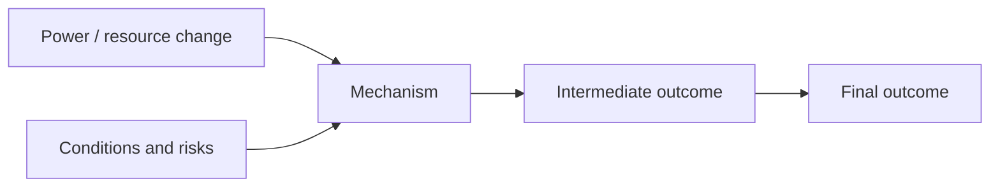
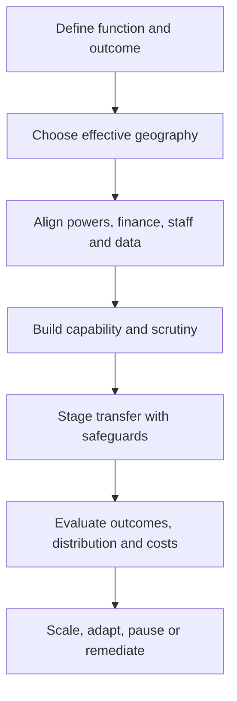

# Rewiring the State evidence landscape: visualisation specification

## Design conclusion

Use a Graphify-style knowledge graph **as the exploratory doorway**, but not as the only way to read the evidence. The primary graph should have a deterministic clustered layout, explicit node types and a persistent detail panel. It should be backed by an accessible claim–evidence matrix and a simpler causal-pathway view.

The intended sequence is:

1. **Overview:** “What does the statement claim, and where is the evidence strong, mixed or missing?”
2. **Explore:** filter by theme, portfolio, department, geography, directness, design, direction and confidence.
3. **Understand:** select a claim and see its causal pathway, conditions, counter-evidence and source cards.
4. **Act:** open implementation dependencies and evaluation requirements.

## 1. Three-layer architecture

### Layer A — Exploratory evidence landscape

The full-screen overview contains five vertical bands:

| Band | Node types | Purpose |
|---|---|---|
| 1 | Statement claims | Exact or tightly paraphrased propositions in the Cabinet statement |
| 2 | Mechanisms | Local information, coordination, incentives, participation, experimentation |
| 3 | Conditions and risks | Capability, equalisation, fragmentation, data, transition, spillovers, capture |
| 4 | Outcomes | Growth, access, health, prevention, savings, equity, accountability, resilience |
| 5 | Evidence bodies | Individual high-salience studies plus grouped reviews/audits |

Within each band, nodes are grouped vertically by the eight evidence themes. Fixed coordinates are generated from `band_order`, `theme_order` and `rank`; they do not drift after page load.

Edges have semantic types:

- `claims_via` — claim to mechanism;
- `depends_on` — mechanism to condition;
- `intended_to_change` — mechanism to outcome;
- `supports` — evidence to claim/pathway;
- `challenges` — evidence contradicts or qualifies an expected effect;
- `null_for` — evidence found no clear effect on an outcome;
- `transfers_with_caution` — indirect international evidence;
- `overlaps_with` — portfolio or departmental overlap (off by default).

Do not encode evidence direction only with colour. Use solid, dashed and dotted line patterns plus arrow labels available to screen readers.

### Layer B — Evidence-weighted causal pathway

Selecting a claim opens a stable left-to-right pathway:



Each arrow displays:

- body-of-evidence confidence;
- number of direct and indirect sources, shown separately;
- supportive / mixed / challenging balance;
- short statement of what is actually evidenced;
- “transfer conditions” for Tier 2–4 evidence.

The pathway should reveal that some evidence attaches to only one link. For example, Sure Start supports `integrated prevention → long-run benefits`; it does not directly support `devolution → integrated prevention`.

### Layer C — Claim–evidence matrix and cards

This is the accessible source of truth and default mobile view.

Each claim begins with:

1. **Conclusion** — one sentence;
2. **Confidence** — High / Moderate / Low / Very low;
3. **Evidence balance** — supportive / mixed / challenging / gap;
4. **Best direct evidence**;
5. **Best adverse or null evidence**;
6. **Conditions for success**;
7. **Transferability note**;
8. expandable methodology and bibliography.

The matrix columns are claim, judgement, confidence, direct England count, indirect count, key conditions and evidence-gap flag. It can be sorted without changing the graph’s evidence meaning.

## 2. Supplementary implementation dependency map

Use a separate dependency view because implementation is a sequence, not an evidence network:



Each step links to its supporting evidence and open evaluation questions. The “scale, adapt, pause or remediate” language is neutral and operational; it avoids presenting organisational withdrawal as the purpose of reform.

## 3. Data model

### 3.1 Node schema

```json
{
  "id": "claim-growth-01",
  "type": "claim",
  "label": "Devolution accelerates local growth",
  "short_label": "Growth",
  "theme_ids": ["growth", "fiscal"],
  "portfolio_ids": ["transport", "housing", "skills", "business", "culture", "digital"],
  "department_assignments": [
    {"department_id": "mhclg", "valid_from": "2026-07-31", "valid_to": null}
  ],
  "statement_status": "explicit",
  "confidence": "moderate",
  "evidence_balance": "mixed",
  "direct_source_count": 3,
  "indirect_source_count": 8,
  "x_band": 1,
  "theme_order": 3,
  "rank": 1
}
```

### 3.2 Evidence node additions

```json
{
  "id": "E37",
  "type": "evidence",
  "citation": "Sweeney (2026)",
  "design": "difference-in-differences",
  "geography": "England",
  "directness_tier": 1,
  "quality": "medium-high",
  "url": "https://doi.org/10.1177/00420980251408416"
}
```

### 3.3 Edge schema

```json
{
  "id": "edge-E37-growth",
  "source": "E37",
  "target": "claim-growth-01",
  "relation": "challenges",
  "finding": "No overall growth acceleration; stronger districts sometimes pulled ahead",
  "relationship_confidence": "moderate",
  "directness_tier": 1,
  "outcomes": ["gdp_per_capita", "within_region_equity"],
  "analyst_note": "Mayoral status is a bundled and incomplete proxy for devolved powers"
}
```

Confidence attaches to the **edge/claim relationship**, not just the source. A high-quality study can provide low-confidence evidence for a claim if it is indirect.

## 4. Stable portfolio and department filters

### Stable portfolios

- children, youth and families;
- civil society and communities;
- arts and culture;
- heritage;
- sport and physical activity;
- visitor economy;
- creative industries;
- digital infrastructure;
- transport;
- housing and planning;
- skills and employment;
- health and social care;
- local government finance;
- public bodies and regulation;
- data and digital government.

### Department mapping

Department is metadata, because departmental ownership changes. The mapping is many-to-many and time-stamped. The interface should say “Department assignment as at [date]”.

When a user selects one department:

- nodes solely within that department remain fully opaque;
- shared portfolio nodes remain visible with a split or multiple-department badge;
- edges crossing to another department are retained and labelled “cross-department dependency”;
- a “show overlaps only” control reveals shared responsibilities.

Do not infer a department from the first portfolio tag. Maintain an explicit `portfolio_department_map` table.

## 5. Interaction behaviour

### Node selection

Click/tap or keyboard activation must do four visible things:

1. add a thick focus ring around the selected node;
2. dim unrelated nodes and edges to 20–30% opacity;
3. retain all one-hop neighbours at full opacity;
4. open a persistent detail drawer headed “Selected: [node label]”.

This resolves the current failure mode where the interface announces a highlight but gives no visible location or explanation.

The detail drawer includes “Why is this connected?”, which describes the selected edge in plain language. A “Reset view” control remains visible at all times.

### Filters

Every dropdown must modify the URL query string, update an on-screen result count and produce a visible filter chip. Example:

`?theme=growth&department=mhclg&direction=challenging&directness=1,2`

If no results remain, show “No evidence matches these filters” with a one-click clear action. Disabled combinations should say why.

Suggested controls:

- Theme
- Portfolio
- Department as at date
- Geography
- Directness tier
- Study design
- Evidence direction
- Quality
- Body confidence
- Show: claims / mechanisms / conditions / outcomes / sources

### Search

Search matches labels, citation, findings and portfolio tags. Results are shown as a list before the graph zooms. Avoid zooming on every keystroke.

## 6. Visual grammar

### Shapes

| Type | Shape |
|---|---|
| Statement claim | rounded rectangle |
| Analyst inference | hexagon |
| Mechanism | circle |
| Condition/risk | diamond |
| Outcome | pill |
| Empirical source | document card |
| Evidence gap | outlined rectangle with question mark |

### Evidence direction

| Relation | Line treatment |
|---|---|
| Supports | solid line, arrow toward claim/pathway |
| Conditions | dashed line |
| Challenges | solid line with bar/contrasting arrowhead |
| Null | dotted line |
| Indirect transfer | lighter double-dash plus tier badge |

Theme colours should not also carry direction. Use a colour-blind-safe palette and ensure a 3:1 graphical contrast ratio and 4.5:1 text contrast ratio.

### Quantity versus strength

- node size may represent number of connected sources;
- border weight represents body confidence;
- a small segmented badge represents supportive/mixed/challenging balance;
- never make a node appear “strong” only because it has many low-quality sources.

## 7. Dark mode

Use semantic tokens rather than hard-coded colours:

```css
:root {
  --surface: #ffffff;
  --surface-raised: #f6f7f9;
  --text: #18202a;
  --muted: #5b6673;
  --edge: #52606d;
  --focus: #005fcc;
}

[data-theme="dark"] {
  --surface: #11161d;
  --surface-raised: #1b2430;
  --text: #f3f6f9;
  --muted: #b9c2cc;
  --edge: #a7b4c2;
  --focus: #78b7ff;
}
```

All canvas/SVG colours must be derived from the active tokens on theme change. Do not place low-opacity coloured text on dark nodes. Selected and focused states need distinct outlines in both themes.

## 8. Mobile and accessibility

At widths below 768px:

- default to the conclusion-first claim-card list;
- provide “Explore graph” as an optional tab;
- use a bottom sheet for selected-node detail;
- collapse filters into a full-height panel with an applied-filter count;
- keep tap targets at least 44 by 44 CSS pixels;
- avoid horizontal page scrolling; allow controlled pan/zoom only inside the graph;
- include a “View as table” control at every width.

Accessibility requirements:

- graph has a descriptive heading and short text summary;
- every node is keyboard focusable in a logical band/theme order;
- arrow keys move within a band; Tab moves between interface regions;
- selection is announced through an ARIA live region, but never only announced—visual state changes too;
- evidence direction is conveyed by text and line pattern, not colour alone;
- reduced-motion setting disables animated re-layout and animated zoom;
- downloadable CSV contains the current filtered evidence set;
- exact statement text and analyst paraphrase are labelled separately.

## 9. Initial content hierarchy

The landing summary should state:

> **Bottom line:** Evidence supports devolution as a conditional institution-building strategy, not as an automatic route to growth or savings. Capability, coherent powers, equalisation, accountability and transition design determine whether local flexibility creates public value.

Then show four compact findings:

1. **Strongest support:** capability, coherent responsibilities and usable accountability matter.
2. **Most promising direct evidence:** integrated health and public-service alignment in Greater Manchester.
3. **Biggest contradiction:** English growth estimates are mixed and gains may concentrate in stronger places.
4. **Largest gap:** effects of shrinking the centre or moving ALB functions.

Details, context, methods and bibliography sit in expandable sections after the conclusion—not before it.

## 10. Acceptance tests

1. Selecting any node produces an unmistakable visible focus state and opens the correct details.
2. Each filter changes the visible set, updates count/chip/query string and survives page refresh.
3. Dark mode passes automated contrast tests and manual SVG/canvas checks.
4. All claims can be reached and understood without using the graph.
5. Screen-reader order distinguishes statement claims, analyst inferences and evidence.
6. Department filters preserve overlaps and display the assignment date.
7. Source count and confidence are separately encoded and labelled.
8. Mobile view starts with conclusions and has no page-level horizontal scroll.
9. Keyboard users can select, clear and inspect nodes and edges.
10. Every evidence card links to the verified source and exposes quality, directness and transferability.

## 11. Recommended implementation sequence

1. Build and validate the claim–evidence JSON/CSV.
2. Implement the accessible card/matrix view.
3. Add filters and URL state, using the matrix as the test oracle.
4. Add the deterministic graph as an alternate view.
5. Add the selected-claim causal pathway.
6. Add department-overlap metadata and the implementation dependency map.
7. Run keyboard, screen-reader, dark-mode and mobile tests before visual polish.

The graph should be an interface over a transparent evidence model, not a separate visual artefact with its own undocumented logic.
